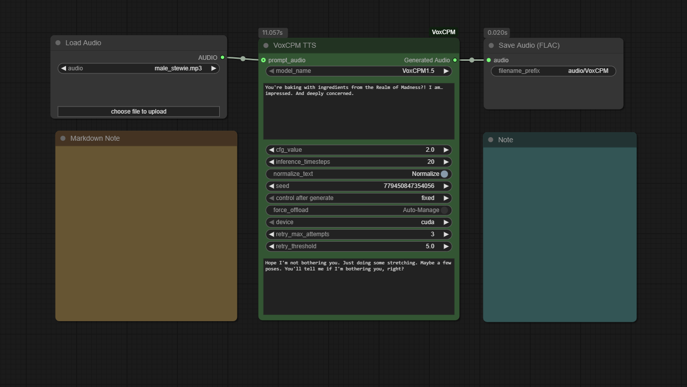

<!-- Improved compatibility of back to top link -->

<div id="readme-top" align="center">
  <h1 align="center">ComfyUI-VoxCPM</h1>

  <a href="https://github.com/wildminder/ComfyUI-VoxCPM">    
    
  </a>

  <p align="center">
    A custom node for ComfyUI that integrates <strong>VoxCPM</strong>, a novel tokenizer-free TTS system for context-aware speech generation and true-to-life voice cloning.
    <br />
    <br />
    <a href="https://github.com/wildminder/ComfyUI-VoxCPM/issues/new?labels=bug&template=bug-report---.md">Report Bug</a>
    ·
    <a href="https://github.com/wildminder/ComfyUI-VoxCPM/issues/new?labels=enhancement&template=feature-request---.md">Request Feature</a>
  </p>
</div>

<!-- PROJECT SHIELDS -->
<div align="center">

[![Stargazers][stars-shield]][stars-url]
[![Issues][issues-shield]][issues-url]
[![Forks][forks-shield]][forks-url]

</div>

<br>

## About The Project

VoxCPM is a novel tokenizer-free Text-to-Speech system that redefines realism in speech synthesis by modeling speech in a continuous space. Built on the MiniCPM-4 backbone, it excels at generating highly expressive speech and performing accurate zero-shot voice cloning.

<div align="center">
      
  </div>
  
This custom node handles everything from model downloading and memory management to audio processing, allowing you to generate high-quality speech directly from a text script and optional reference audio files.

**✨ Key Features:**
*   **High-Fidelity Audio (v1.5):** Supports 44.1kHz sampling rate, preserving high-frequency details for clearer, richer audio.
*   **LoRA Support:** Load fine-tuned LoRA checkpoints to apply specific voice styles or improvements.
*   **Context-Aware Expressive Speech:** The model understands text context to generate appropriate prosody and vocal expression.
*   **True-to-Life Voice Cloning:** Clone a voice's timbre, accent, and emotional tone from a short audio sample.
*   **Zero-Shot TTS:** Generate high-quality speech without any reference audio.
*   **Automatic Model Management:** Required models are downloaded automatically and managed efficiently by ComfyUI to save VRAM.
*   **Fine-Grained Control:** Adjust parameters like CFG scale and inference steps to tune the performance and style.
*   **High-Efficiency Synthesis:** VoxCPM 1.5 reduces the token rate (6.25Hz), enabling faster generation even on consumer-grade hardware.

<p align="right">(<a href="#readme-top">back to top</a>)</p>

## 🚀 Getting Started

The easiest way to install is via **ComfyUI Manager**. Search for `ComfyUI-VoxCPM` and click "Install".

Alternatively, to install manually:

1.  **Clone the Repository:**
    Navigate to your `ComfyUI/custom_nodes/` directory and clone this repository:
    ```sh
    git clone https://github.com/wildminder/ComfyUI-VoxCPM.git
    ```

2.  **Install Dependencies:**
    Open a terminal or command prompt, navigate into the cloned `ComfyUI-VoxCPM` directory, and install the required Python packages:
    ```sh
    cd ComfyUI-VoxCPM
    pip install -r requirements.txt
    ```

3.  **Start/Restart ComfyUI:**
    Launch ComfyUI. The "VoxCPM TTS" node will appear under the `audio/tts` category. The first time you use the node, it will automatically download the selected model to your `ComfyUI/models/tts/VoxCPM/` folder.

## Models
This node automatically downloads the required model files. You can select the specific version in the node settings.

| Model | Parameters | Sampling Rate | Description | Hugging Face Link |
|:---|:---:|:---:|:---|:---|
| **VoxCPM1.5** | 800M | 44.1kHz | **Recommended.** Latest version with LoRA support, improved fidelity and efficiency. | [openbmb/VoxCPM1.5](https://huggingface.co/openbmb/VoxCPM1.5) |
| VoxCPM-0.5B | 640M | 16kHz | Original version. | [openbmb/VoxCPM-0.5B](https://huggingface.co/openbmb/VoxCPM-0.5B) |

<p align="right">(<a href="#readme-top">back to top</a>)</p>

## 🛠️ Usage

1.  **Add Nodes:** Add the `VoxCPM TTS` node to your graph. For voice cloning, add a `Load Audio` node to load your reference voice file.
2.  **Connect Voice (for Cloning):** Connect the `AUDIO` output from the `Load Audio` node to the `prompt_audio` input on the VoxCPM TTS node.
3.  **Write Text:**
    *   For **voice cloning**, provide the transcript of your reference audio in the `prompt_text` field.
    *   Enter the text you want to generate in the main `text` field.
4.  **Select LoRA (Optional):** Choose a LoRA from the dropdown if you have one installed in `models/loras`.
5.  **Generate:** Queue the prompt. The node will process the text and generate a single audio file.

> [!NOTE]
> **Denoising:** The original VoxCPM library includes a built-in denoiser (ZipEnhancer). This feature is disabled in this node to keep dependencies light and allow users to choose their own audio preprocessing workflow within ComfyUI.

### Node Inputs

*   **`model_name`**: Select the VoxCPM model to use (v1.5 recommended).
*   **`lora_name`**: Select a LoRA checkpoint from your `ComfyUI/models/loras` folder to apply style transfer or fine-tuning. Set to "None" to disable.
*   **`text`**: The target text to synthesize into speech.
*   **`prompt_audio` (Optional)**: A reference audio clip for voice cloning.
*   **`prompt_text` (Optional)**: The exact transcript of the `prompt_audio`. This is **required** if `prompt_audio` is connected.
*   **`cfg_value`**: Classifier-Free Guidance scale. Higher values increase adherence to the voice prompt but may reduce naturalness. Default is 2.0.
*   **`inference_timesteps`**: Number of diffusion steps for audio generation. More steps can improve quality but take longer. Default is 10.
*   **`min_tokens`**: Minimum length of generated audio tokens (default: 2).
*   **`max_tokens`**: Maximum length of generated audio tokens (default: 2048).
*   **`normalize_text`**: Enable to automatically process numbers, abbreviations, and punctuation. Disable for precise control with phoneme inputs.
*   **`seed`**: A seed for reproducibility. Set to -1 for a random seed on each run.
*   **`force_offload`**: Forces the model to be completely offloaded from VRAM after generation.
*   **`device`**: Select the inference device (cuda, cpu, mps, directml). Defaults to the best available.
*   **`retry_max_attempts`**: Maximum number of auto-retries if the generation fails (e.g., babbling or silence).
*   **`retry_threshold`**: Threshold for detecting bad generations based on audio/text length ratio.

<p align="right">(<a href="#readme-top">back to top</a>)</p>

## 🎨 Using LoRA (Fine-Tuning)

VoxCPM 1.5 supports LoRA to alter the voice style or improve specific characteristics.

1.  **Installation:** Place your `.safetensors` LoRA files in `ComfyUI/models/loras/`.
2.  **Selection:** Refresh the node, then select your file in the `lora_name` dropdown.

### 💡 LoRA + Voice Cloning Observations
While LoRA is often used for specific trained styles, combining it with **Voice Cloning** (`prompt_audio`) can yield superior results:

*   **Enhanced Clarity:** Using a LoRA alongside a reference audio clip (`prompt_audio`) often produces clearer speech with significantly fewer artifacts compared to using the audio prompt alone.
*   **"Warm-up" Effect:** Observations suggest that even after setting the LoRA input back to "None", subsequent generations using `prompt_audio` often maintain higher quality compared to a fresh cold start. This implies the model may benefit from a "warm-up" with LoRA weights loaded. If you are getting average results, try loading a LoRA once, generating a sound, and then disabling it.

<p align="right">(<a href="#readme-top">back to top</a>)</p>

## 🎤 Achieving High-Quality Voice Clones

To achieve the best voice cloning results, providing an accurate `prompt_text` is **critical**. This text acts as a transcript that aligns the sound of the `prompt_audio` with the words being spoken, teaching the model the speaker's unique vocal characteristics.

**With VoxCPM 1.5**, the model supports 44.1kHz sampling. This means the quality of your input reference audio directly impacts the output. High-quality, clean input audio will yield significantly better results than low-fidelity recordings.

> [!Warning]
> `prompt_text` is the exact transcript of the prompt_audio. It's not a general description of the voice, nor is it for providing emotional cues. Its job is to create a precise, moment-by-moment alignment between the words being spoken and the sounds being made.

#### 1. **Provide a Verbatim Transcript**
The `prompt_text` must be a word-for-word transcript of the `prompt_audio`. Do not summarize or describe the audio.

-   ✅ **Correct:** `The quick brown fox jumps over the lazy dog.`
-   ❌ **Incorrect:** `A person saying a sentence about a fox.`

#### 2. **Punctuation is Important**
Use accurate punctuation to capture the speaker's intonation. The model learns how the speaker ends sentences, asks questions, or shows excitement.

#### 3. **Match Audio and Text Length**
The audio clip should be long enough to capture the speaker's natural pacing and rhythm.

-   👍 **Good:** A 5-15 second clip of continuous, clear speech.
-   ⚠️ **Warning:** Very short clips (< 3 seconds) may result in a less stable or robotic-sounding clone.

<br/>

## 👩‍🍳 A Voice Chef's Guide

### 🥚 Step 1: Prepare Your Base Ingredients (Content)

First, choose how you’d like to input your text:
1.  **Regular Text (Classic Mode)**
    *   ✅ Keep **`normalize_text` ON**. Type naturally (e.g., "Hello, world! 123"). The system will automatically process numbers and punctuation.
2.  **Phoneme Input (Native Mode)**
    *   ❌ Turn **`normalize_text` OFF**. Enter phoneme text like `{HH AH0 L OW1}` (EN) or `{ni3}{hao3}` (ZH) for precise pronunciation control.

---
### 🍳 Step 2: Choose Your Flavor Profile (Voice Style)

This is the secret sauce that gives your audio its unique sound.
1.  **With a Prompt (Voice Cloning)**
    *   A `prompt_audio` file provides the desired acoustic characteristics. The speaker's timbre, speaking style, and even ambiance can be replicated.
    *   For best results, use a clean, high-quality audio recording as the prompt.
2.  **Without a Prompt (Zero-Shot Generation)**
    *   If no prompt is provided, VoxCPM becomes a creative chef! It will infer a fitting speaking style based on the text itself, thanks to its foundation model, MiniCPM-4.

---
### 🧂 Step 3: The Final Seasoning (Fine-Tuning)

For master chefs who want to tweak the flavor, here are two key spices:
*   **`cfg_value` (How Closely to Follow the Recipe)**
    *   **Default (2.0):** A great starting point.
    *   **Lower it:** If the cloned voice sounds strained or weird, lowering this value tells the model to be more relaxed and improvisational.
    *   **Raise it slightly:** To maximize clarity and adherence to the prompt voice or text.
*   **`inference_timesteps` (Simmering Time: Quality vs. Speed)**
    *   **Lower (e.g., 5-10):** For a quick snack. Perfect for fast drafts and experiments.
    *   **Higher (e.g., 15-25):** For a gourmet meal. This lets the model "simmer" longer, refining the audio for superior detail and naturalness.


<p align="right">(<a href="#readme-top">back to top</a>)</p>

## ⚠️ Risks and Limitations
*   **Potential for Misuse:** The voice cloning capability is powerful and could be misused for creating convincing deepfakes. Users of this node must not use it to create content that infringes upon the rights of individuals. It is strictly forbidden to use this for any illegal or unethical purposes.
*   **Technical Limitations:** The model may occasionally exhibit instability with very long or complex inputs.
*   **Bilingual Model:** VoxCPM is trained primarily on Chinese and English data. Performance on other languages is not guaranteed.
*   This node is released for research and development purposes. Please use it responsibly.

<p align="right">(<a href="#readme-top">back to top</a>)</p>

<!-- LICENSE -->
## License

The VoxCPM model and its components are subject to the [Apache-2.0 License](https://github.com/OpenBMB/VoxCPM/blob/main/LICENSE) provided by OpenBMB.

<p align="right">(<a href="#readme-top">back to top</a>)</p>

<!-- ACKNOWLEDGMENTS -->
## Acknowledgments

*   **OpenBMB & ModelBest** for creating and open-sourcing the incredible [VoxCPM](https://github.com/OpenBMB/VoxCPM) project.
*   **The ComfyUI team** for their powerful and extensible platform.

<p align="right">(<a href="#readme-top">back to top</a>)</p>

<p align="center">══════════════════════════════════</p>

Beyond the code, I believe in the power of community and continuous learning. I invite you to join the 'TokenDiff AI News' and 'TokenDiff Community Hub'

<table border="0" align="center" cellspacing="10" cellpadding="0">
  <tr>
    <td align="center" valign="top">
      <h4>TokenDiff AI News</h4>
      <a href="https://t.me/TokenDiff">
        
      </a>
      <p><sub>🗞️ AI for every home, creativity for every mind!</sub></p>
    </td>
    <td align="center" valign="top">
      <h4>TokenDiff Community Hub</h4>
      <a href="https://t.me/TokenDiff_hub">
        
      </a>
      <p><sub>💬 questions, help, and thoughtful discussion.</sub> </p>
    </td>
  </tr>
</table>

<p align="center">══════════════════════════════════</p>

<!-- MARKDOWN LINKS & IMAGES -->
[stars-shield]: https://img.shields.io/github/stars/wildminder/ComfyUI-VoxCPM.svg?style=for-the-badge
[stars-url]: https://github.com/wildminder/ComfyUI-VoxCPM/stargazers
[issues-shield]: https://img.shields.io/github/issues/wildminder/ComfyUI-VoxCPM.svg?style=for-the-badge
[issues-url]: https://github.com/wildminder/ComfyUI-VoxCPM/issues
[forks-shield]: https://img.shields.io/github/forks/wildminder/ComfyUI-VoxCPM.svg?style=for-the-badge
[forks-url]: https://github.com/wildminder/ComfyUI-VoxCPM/network/members
